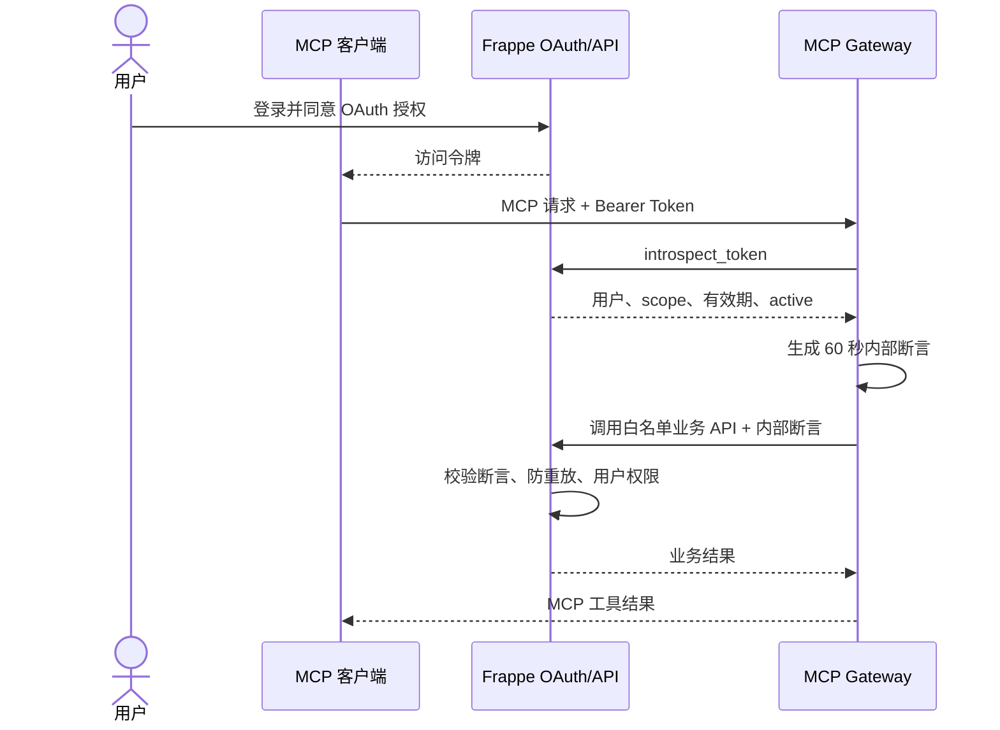

# Frappe MCP Gateway

面向 Frappe Framework 与 ERPNext 应用的 OAuth 保护型 MCP 网关。

Frappe MCP Gateway 使用官方 MCP Python SDK，将 AI 客户端使用的 MCP
协议、OAuth 令牌校验和业务工具调用放在独立 sidecar 中，避免把 MCP
运行时依赖安装进 Frappe/Bench 容器。Frappe 继续负责用户、角色、OAuth
授权和业务权限，网关不引入第二套账号系统。

> An OAuth-protected, standalone MCP gateway for Frappe and ERPNext
> applications, built with the official MCP Python SDK.

## 为什么需要这个项目

Frappe 原生提供用户、角色、OAuth Provider 和业务 API，但普通 MCP
客户端还需要一个符合 MCP 规范的资源服务器。本项目连接这两部分：

- 复用 Frappe OAuth，不保存用户密码，也不建立独立用户库。
- 每次 MCP 请求都通过 Frappe introspection 校验访问令牌。
- OAuth 访问令牌不会转发给业务 API。
- 网关签发仅 60 秒有效、不可重放的内部断言，将已验证的 Frappe 用户传给
  业务接口。
- 业务接口仍由 Frappe 权限、所有者规则和服务端校验保护。
- 用户在 Frappe 中撤销授权后，后续 MCP 请求会立即被拒绝。

## 适用场景

- 让 ChatGPT、Claude Desktop、Codex 或其他 MCP 客户端安全访问 Frappe。
- 为 ERPNext 提供销售、库存、采购、财务等受控 AI 工具。
- 为自定义 Frappe App 暴露面向用户的 MCP 工具。
- 多个 Frappe 应用共用认证、传输与 HTTP 客户端基础设施。

当前仓库包含 `personal_health` 工具包，用于读取和创建当前用户的健康身体
指标。认证、MCP 传输、内部断言和 Frappe HTTP 客户端都是通用模块，其他
应用可以增加自己的工具包。

## 工作原理



详细设计见[架构与安全模型](docs/architecture.md)。

## 用户如何使用

1. 用户在支持远程 MCP 和 OAuth 的客户端中添加
   `https://example.com/mcp`。
2. 客户端发现 OAuth 元数据，并将用户重定向到 Frappe 登录页面。
3. 用户查看申请的 scope，允许访问。
4. 客户端取得访问令牌，随后可以列出并调用 MCP 工具。
5. 用户随时可以在 Frappe 的“已授权应用”页面撤销访问。

网关不需要用户再次注册账号。客户端能做什么，取决于 OAuth scope、网关
注册的工具以及该用户在 Frappe 中原本拥有的权限。

## 快速启动

要求：

- Docker 24+，或 Python 3.14。
- 可访问的 Frappe 站点。
- Frappe OAuth 客户端及所需 scope。
- 一个能够校验网关内部断言的 Frappe App。

```sh
git clone https://github.com/saoxia/frappe-mcp-gateway.git
cd frappe-mcp-gateway
cp .env.example .env
```

编辑 `.env`，至少替换站点地址、站点名、scope 和断言密钥。密钥应使用
至少 32 个随机字符，并在 Frappe 站点配置中保存相同值。

```sh
docker build -t frappe-mcp-gateway:runtime .
docker run --rm \
  --env-file .env \
  -p 127.0.0.1:8100:8000 \
  frappe-mcp-gateway:runtime
```

检查服务：

```sh
curl http://127.0.0.1:8100/health
```

生产环境应由 Nginx、Caddy 或其他反向代理提供 HTTPS，并只将 `/mcp` 和
OAuth protected-resource metadata 暴露到公网。完整步骤见
[部署与运维](docs/deployment.md)。

## HTTP 端点

| 路径 | 用途 |
| --- | --- |
| `/health` | 容器健康检查 |
| `/mcp` | Streamable HTTP MCP 端点 |
| `/.well-known/oauth-protected-resource/mcp` | OAuth 受保护资源元数据 |

## 文档

- [架构与安全模型](docs/architecture.md)
- [配置参考](docs/configuration.md)
- [接入 Frappe App](docs/frappe-integration.md)
- [部署与运维](docs/deployment.md)
- [开发新工具包](docs/tool-development.md)

## 测试

```sh
python -m pip install -e . pytest
pytest
```

测试覆盖配置校验、Frappe API 请求及内部断言的关键行为。接入方还应在
Frappe App 中测试断言签名、过期、audience、scope、防重放和用户权限。

## 项目边界

本项目不是：

- Frappe 或 ERPNext 的替代身份系统。
- 一个可以绕过 Frappe 权限的超级管理员代理。
- OAuth 访问令牌数据库。
- 自动把所有 DocType 暴露给 AI 的通用 CRUD 接口。

推荐只注册明确设计、参数受限且经过权限检查的业务工具。涉及创建、修改、
提交或删除业务数据时，MCP 客户端应先获得用户确认。

## 相关仓库

- [saoxia/frappe-personal](https://github.com/saoxia/frappe-personal)：当前
  Personal 工具包对应的 Frappe App 与生产部署配置。
- [Model Context Protocol Python SDK](https://github.com/modelcontextprotocol/python-sdk)
- [Frappe Framework](https://github.com/frappe/frappe)

## License

[MIT](LICENSE)
